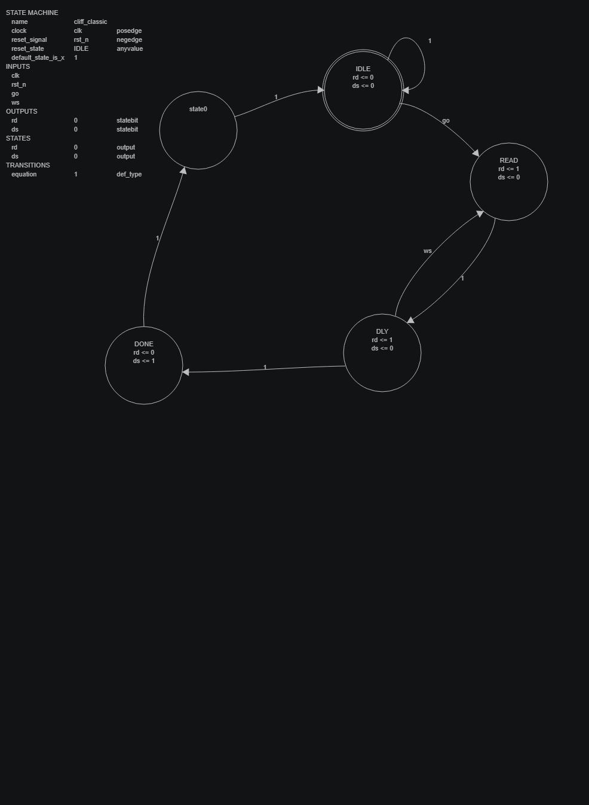

# Fizzim FSM Editor for VS Code

A native VS Code editor for **[Fizzim](http://www.fizzim.com/)** `.fzm` finite
state machine diagrams. Draw state machines on a canvas and generate
synthesizable Verilog / SystemVerilog / VHDL — without leaving your editor.



Fizzim is a well-known FSM-design tool built as a Java/Swing desktop app. This
extension is a from-scratch reimplementation of its diagram editor as a VS Code
custom editor, reading and writing the exact same `.fzm` file format, so it's a
drop-in replacement for the desktop GUI.

## Features

- **Diagram editor**: states, transitions, self-loops (loopbacks), free text,
  and cross-page connectors on a zoomable canvas.
- **Full property dialogs**: per-state and per-transition attribute tables,
  Mealy outputs, priority + Graycode encoding, custom colors.
- **Global Attributes editor**: inputs, outputs, flags, multi-bit signals,
  reset signal/state, user attributes — all 5 tabs, matching the original GUI.
- **Generate HDL**: runs the bundled Fizzim code generator (`fizzim.pl`) on the
  current diagram and opens the resulting Verilog / SystemVerilog / VHDL.
  Works out of the box — no separate install needed (Perl must be on your
  system).
- **Export PNG/JPEG**, Page Setup, multi-page diagrams, dark-mode canvas
  toggle, undo/redo, drag-select, keyboard shortcuts.
- A Fizzim-style menu bar (File / Edit / Global Attributes / View / Help) with
  a modern VS Code look.

## Getting started

1. Install the extension.
2. Open any `.fzm` file, or run **Fizzim: New Diagram** from the Command
   Palette.
3. Right-click the canvas to add states, transitions, and text. Drag to move.
   `Delete` removes the current selection.
4. `Ctrl+S` saves back to the `.fzm` file — the same format the original
   Fizzim desktop app reads.
5. Use **File → Generate HDL** to produce Verilog/VHDL from the diagram.

## Configuration

| Setting | Default | Description |
| --- | --- | --- |
| `fizzim.perlPath` | `perl` | Perl interpreter used to run the code generator. |
| `fizzim.scriptPath` | *(empty)* | Override for `fizzim.pl`. Leave empty to use the version bundled with the extension. |
| `fizzim.language` | `verilog` | Target HDL language: `verilog`, `vhdl`, or `systemverilog`. |
| `fizzim.darkMode` | `false` | Draw the canvas on a dark background. |
| `fizzim.defaultStateColor` | `#000000` | Default color for new states. |
| `fizzim.defaultTransitionColor` | `#000000` | Default color for new transitions. |
| `fizzim.defaultLoopbackColor` | `#000000` | Default color for new loopback transitions. |

All of the above are also editable from the in-editor Preferences dialog.

## Status

Feature parity with the original Fizzim GUI for the full edit → HDL workflow,
plus a few extras (zoom, dark mode, duplicate state). See
[CHANGELOG.md](CHANGELOG.md) for release notes.

Deliberately not ported (VS Code webview limitations or low value): File→Print,
Export→Clipboard, and a couple of cosmetic details in cross-page connector
rendering.

## Development

```bash
npm install
npx tsc --noEmit    # typecheck
npm run build       # bundle extension + webview
npm test             # unit tests (node --test)
npm run package      # produce a .vsix
```

## License

GPL-3.0-or-later, as a derivative of [Fizzim](http://www.fizzim.com/)
(© Zimmer Design Services). See [LICENSE](LICENSE).

Fizzim itself is not affiliated with this project; this is an independent,
open-source reimplementation of its editor for VS Code.
